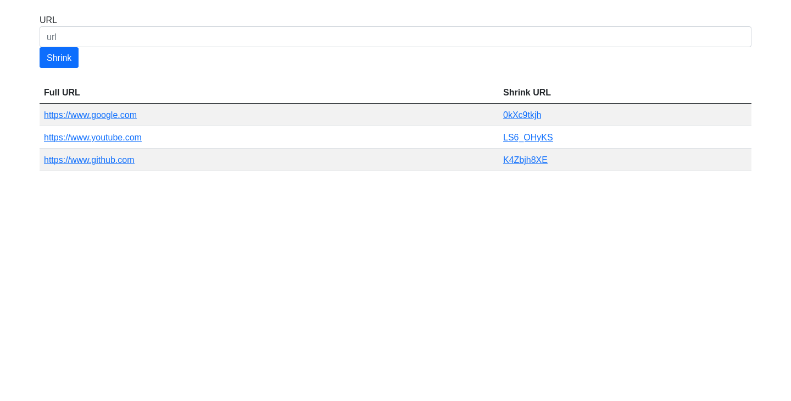

# URL shortener

A simple url shortener using MongoDB, Nodejs, express and express handlebars.

## Screenshot

## Table of contents
- [How to run](#how-to-run)
- [Useful resources](#useful-resources)

### How to run

1. First clone the repo.
2. Next run: `npm i` 
3. Create a .env file and add the next variables:
`PORT` and `MONGO_URI`
4. Run `npm run start`

### Useful resources

- [How To Build A URL Shortener](https://www.youtube.com/watch?v=SLpUKAGnm-g) by web dev simplified - This help me for see the main concepts of the project, solve minor problems and have a better design of the page.
- [Express js prevent GET /favicon.ico](https://stackoverflow.com/questions/35408729/express-js-prevent-get-favicon-ico) - I used this stack overflow post for solve the problem of get favicon.ico in req.params
